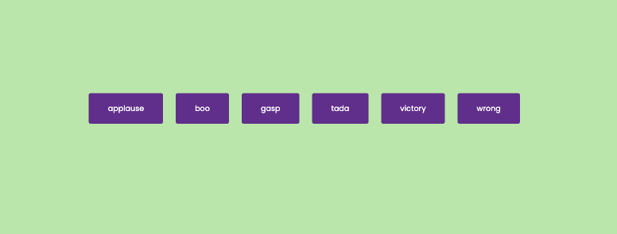

# Sound Board

This is an HTML, CSS, and JavaScript login project that generates sound when a user clicks any of the six buttons available on the screen.

## Getting Started

To get started with this project, you will need to have a basic understanding of HTML, CSS, and JavaScript. You can use any code editor of your choice to work on this project.

## Installation

To install the project, simply clone the repository to your local machine:
git clone: `https://github.com/IqbalAhmadi/sound-board.git`

Alternatively, you can download the ZIP file and extract it to your preferred location.

## Usage

Once you have cloned or downloaded the project, open the `index.html` file in your preferred browser. You should see a page with six buttons on the screen.

To generate sound, simply click any of the six buttons. You should hear a sound play immediately after clicking the button.

## Contributing

If you would like to contribute to this project, you can fork the repository and make your changes. Once you have made your changes, create a pull request and we will review your changes.

## Screenshot

